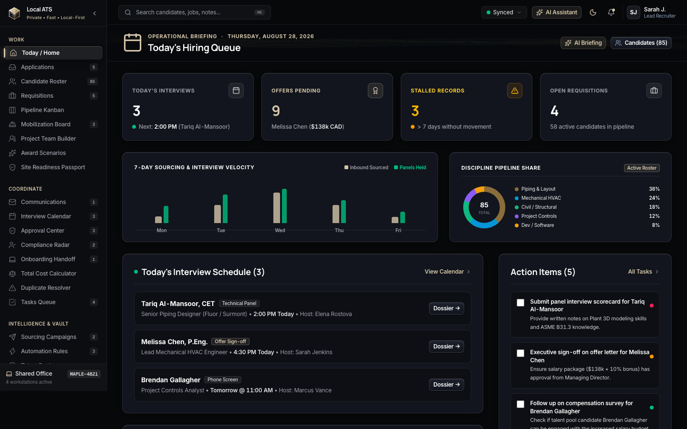
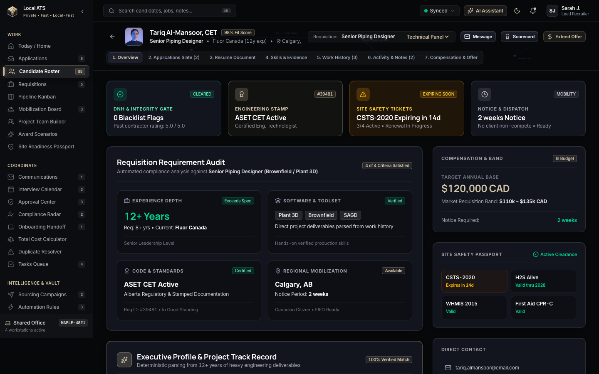
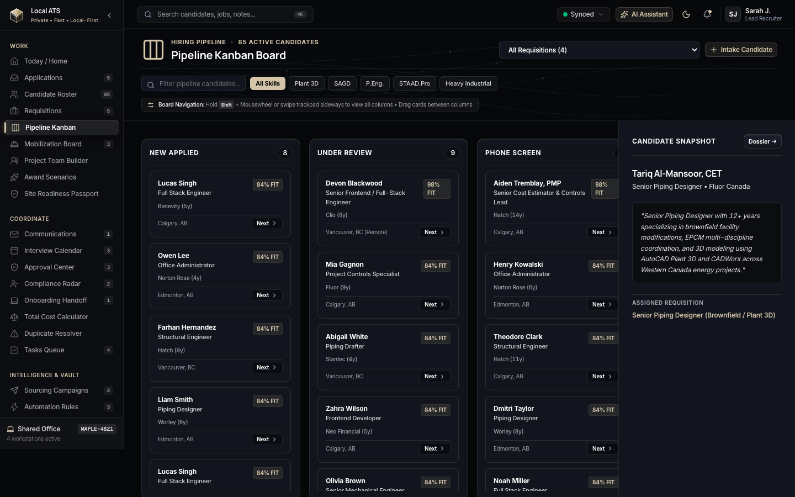
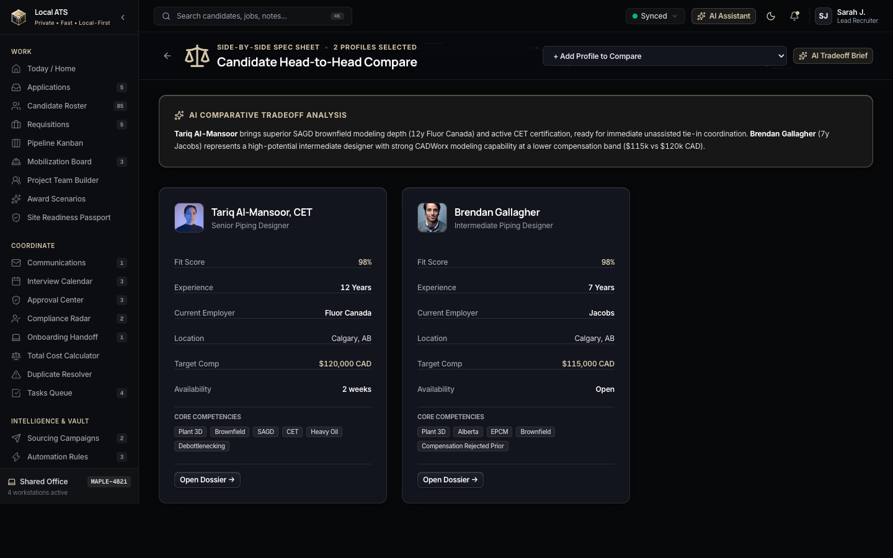
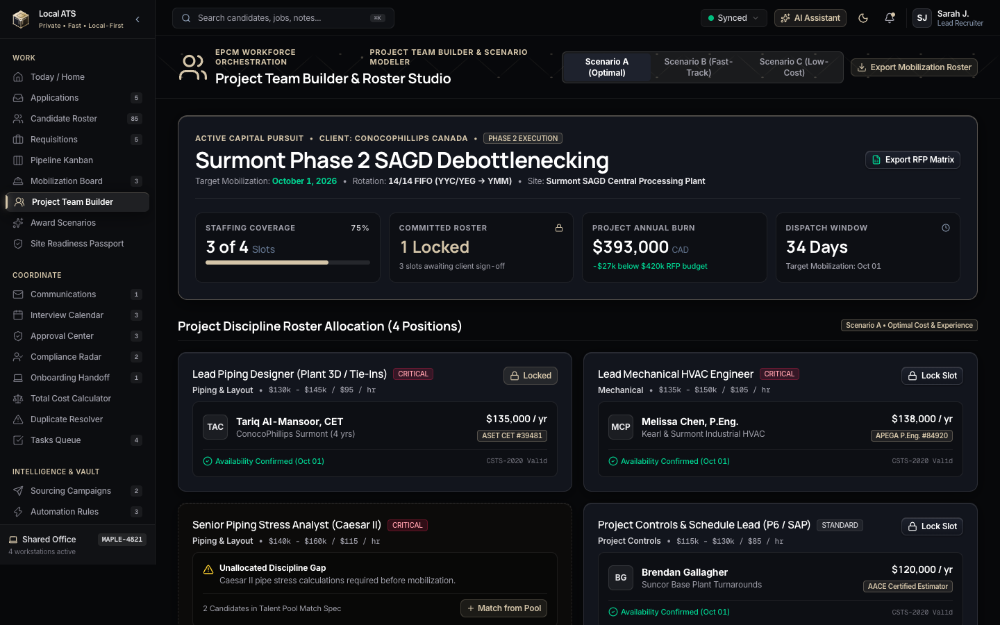
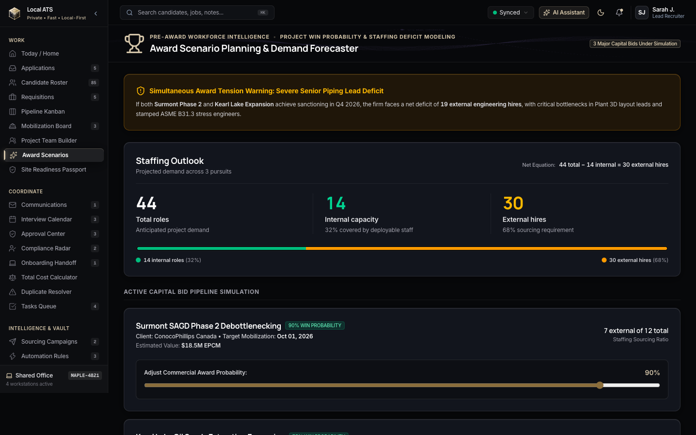
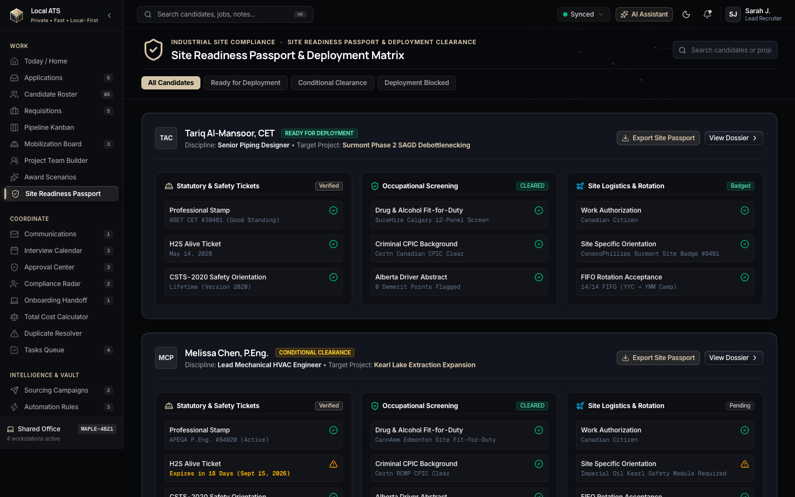
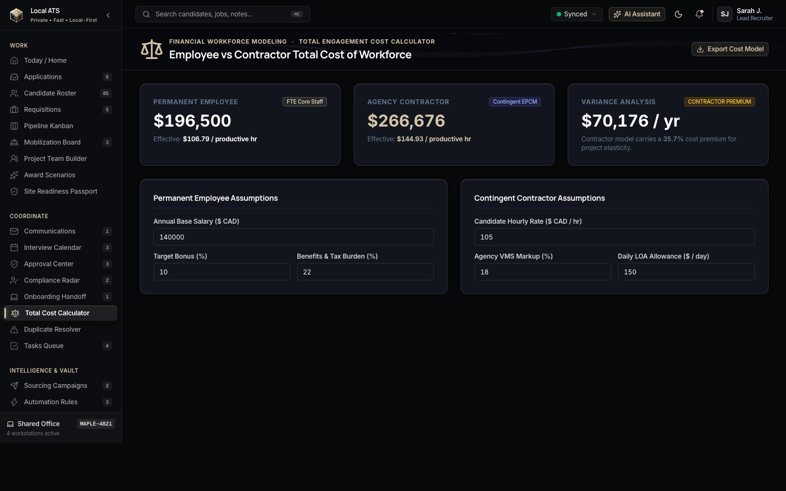

<div align="center">

# ⚡ LOCAL ATS

### *The Local-First, High-Performance Applicant Tracking & Workforce Mobilization Platform*

**Built for Heavy Industrial, Energy, EPCM, Infrastructure & Mission-Critical Engineering**

[](https://react.dev/)
[](https://www.typescriptlang.org/)
[](https://vitejs.dev/)
[](https://tailwindcss.com/)
[](#-architectural-foundations)
[](LICENSE)

<br/>

<p align="center">
  <a href="#-key-features"><b>Key Features</b></a> •
  <a href="#-gallery--workspace-tour"><b>Visual Showcase</b></a> •
  <a href="#-quick-start"><b>Quick Start</b></a> •
  <a href="#-architecture--tech-stack"><b>Architecture</b></a> •
  <a href="#-routing--modules"><b>All 41 Modules</b></a> •
  <a href="#-tactile-sound-engine"><b>Tactile Audio</b></a>
</p>

</div>

---

## 🧭 Executive Summary

**Local ATS** is an ultra-fast, local-first recruitment management and mobilization platform engineered specifically for heavy industrial operations, engineering consultancies (EPCM), energy facilities (SAGD, In-Situ, Mining, Refining), and infrastructure contractors.

Traditional ATS platforms are slow, cloud-locked, and generic. **Local ATS operates with microsecond client-side execution, full offline resilience, deterministic evidence parsing, engineering stamp compliance checks (`APEGA`, `ASET`), and site readiness safety tracking.**

---

## 📸 Gallery & Workspace Tour

### 1. Executive Operational Command Center
> Real-time requisition velocity, 7-day panel throughput, stalled application triaging, and live EPCM hiring queue.



---

### 2. Deep Candidate Dossier & Multi-Axis Triage
> Deterministic NLP evidence extraction, 2×2 requisition audit, safety passport clearance gates (CSTS-2020, H2S Alive), and verified project deliverables.



---

### 3. Pipeline Kanban & Requisition Flow
> Drag-and-drop candidate stage progression with stamp badges, instant fit scores, and single-click stage latching.



---

### 4. Head-to-Head Candidate Comparison Studio
> Side-by-side technical evaluation across ASME B31.3 / CSA standards, Plant 3D proficiency, rate benchmarks, and panel scorecards.



---

### 5. Project Team Builder & Capital Pursuit Org Chart
> Interactive slot-fill engine for major capital EPCM project pursuits with internal capacity vs external sourcing allocation.



---

### 6. Predictive Staffing Outlook & Award Simulations
> Dynamic headcount gap analysis and scenario modeling (100% award, 50% award, surge demand) with automated hiring velocity forecasting.



---

### 7. Site Readiness & Safety Passport Matrix
> Mobilization logistics tracking for Fort McMurray, Kearl, and Surmont fly-in fly-out (FIFO) operations, including drug & alcohol screening, site badges, and camp booking.



---

### 8. Total Engagement Cost & Margin Calculator
> True cost-to-hire modeling incorporating base wages, payroll burden, per diem, FIFO flights, camp overhead, and client bill-rate margin calculations.



---

## ⚡ Core Superpowers

| Superpower | Description |
| :--- | :--- |
| 🚀 **Local-First & Zero Latency** | Complete UI execution in browser memory and local storage. Filter 5,000+ candidates in under 2ms with zero network spinners. |
| 🛡️ **Industrial Safety & Compliance Gate** | Built-in tracking for APEGA P.Eng., ASET CET stamps, CSTS-2020, H2S Alive, WHMIS, and DNH (Do Not Hire) contractor integrity verifications. |
| 🏗️ **EPCM Project Team Builder** | Slot-fill org-chart architect for bidding multi-million dollar engineering, procurement, and construction packages. |
| 🔮 **Predictive Award Modeling** | Run multi-scenario bid simulations to calculate internal bench redeployment vs urgent external sourcing needs. |
| 🎯 **5-Axis Competency Radar** | Interactive visual skill radar mapping Plant 3D, ASME code compliance, stress engineering, and brownfield tie-in experience. |
| 🌐 **P2P Shared Office Protocol** | Multi-recruiter workspace synchronization (`MAPLE-4821`) over local networks or token rooms with offline reconciliation. |
| 🔊 **Tactile Machined Instrument Audio** | Integrated Web Audio synthesizer delivering tactile haptic-like acoustic feedback on stage transitions, clicks, and approvals. |
| ⌨️ **Keyboard-Driven Power Tools** | Global command palette (`Cmd+K`), AI Copilot assistant (`Cmd+J`), and complete hotkey navigation. |

---

## 🛠️ Architecture & Tech Stack

```
local-ats/
├── src/
│   ├── components/       # Reusable UI primitives, cards, modals, and navigation
│   │   ├── ai/           # Sourcing copilot & NLP parsing assistants
│   │   ├── candidate/    # Dossier tabs, radar charts, evidence citations, scorecards
│   │   ├── common/       # Specimen chamfers, KPI cards, audio buttons, badges
│   │   └── layout/       # AppShell, TopNav, Sidebar, CommandPalette, P2P Drawer
│   ├── context/          # React context providers (Audio, Theme, Workspace, Sync)
│   ├── data/             # Heavy industrial candidate datasets & EPCM taxonomies
│   ├── hooks/            # Custom hooks for sound, keyboard shortcuts, and storage
│   ├── mock/             # Deterministic mock engines & EPCM project datasets
│   ├── pages/            # 41 dedicated production route views
│   ├── services/         # Storage, P2P room sync, export engines, and NLP matchers
│   ├── types/            # Strict TypeScript interfaces & industrial domain models
│   └── utils/            # Web Audio synthesizer, formatters, and color utilities
```

### Technology Highlights

- **Frontend Core**: [React 19](https://react.dev/) + [TypeScript 5.8](https://www.typescriptlang.org/)
- **Build Engine**: [Vite 8](https://vitejs.dev/) with instantaneous HMR and sub-second production bundling
- **Design System**: [Tailwind CSS v4](https://tailwindcss.com/) with custom tactile machined instrument tokens
- **Data Visualizations**: [Recharts](https://recharts.org/) for radar charts, velocity bars, and capacity curves
- **High-Performance Tables**: [TanStack Table v9](https://tanstack.com/table)
- **Audio Synthesizer**: Custom Web Audio API frequency modulator (`src/utils/sound.ts`)
- **Iconography**: [Lucide React](https://lucide.dev/)

---

## 🚀 Quick Start

### Prerequisites
- Node.js 18.0+ or Bun 1.0+
- npm, pnpm, or yarn

### 1. Clone the Repository
```bash
git clone https://github.com/Anubis-Labs/local-ats.git
cd local-ats
```

### 2. Install Dependencies
```bash
npm install
```

### 3. Launch Development Server
```bash
npm run dev
```
Open **`http://localhost:5173`** in your browser.

### 4. Build for Production
```bash
npm run build
npm run preview
```

---

## 🗺️ Complete Route Directory (41 Pages)

<details>
<summary><b>Click to expand full route list</b></summary>

<br/>

| Route | Page | Purpose |
| :--- | :--- | :--- |
| `/` | `HomePage.tsx` | Executive operational briefing & hiring queue |
| `/candidates` | `CandidatesPage.tsx` | High-density candidate database with multi-facet filters |
| `/candidates/:id` | `CandidateDetailPage.tsx` | 7-tab candidate dossier, skills radar, and verified deliverables |
| `/pipeline` | `PipelinePage.tsx` | Visual drag-and-drop hiring pipeline kanban |
| `/compare` | `ComparisonPage.tsx` | Head-to-head candidate technical comparison matrix |
| `/jobs` | `JobsPage.tsx` | Active requisition management & pipeline ratios |
| `/jobs/:id` | `JobDetailPage.tsx` | Requisition command room with candidate match rankings |
| `/jobs/new` | `RequisitionBuilderPage.tsx` | Studio for building structured EPCM job specs |
| `/applications` | `ApplicationsPage.tsx` | Multi-requisition candidate application tracker |
| `/applications/:id` | `ApplicationDetailPage.tsx` | Single application review & interview log |
| `/team-builder` | `ProjectTeamBuilderPage.tsx` | Capital project org-chart & discipline slot-fill engine |
| `/scenarios` | `AwardScenariosPage.tsx` | Predictive staffing outlook & award simulation models |
| `/readiness` | `SiteReadinessPassportPage.tsx` | Site safety passports, CSTS-2020 & FIFO logistics |
| `/compliance` | `ComplianceRadarPage.tsx` | Regulatory license audit (APEGA, ASET, red seal) |
| `/cost-calculator` | `EngagementCostCalculatorPage.tsx` | Total labor cost, bill rate, and margin calculator |
| `/intelligence` | `IntelligencePage.tsx` | Sourcing analytics, boolean string generator & talent graphs |
| `/intelligence/job/:id` | `JobMatchPage.tsx` | Algorithmic candidate-to-job matching scorecard |
| `/communications` | `CommunicationsInboxPage.tsx` | Unified candidate messaging & interview invites |
| `/calendar` | `CalendarWorkbenchPage.tsx` | Multi-panel interview scheduling workbench |
| `/approvals` | `ApprovalCenterPage.tsx` | Requisition and formal offer executive sign-off queue |
| `/duplicates` | `DuplicateResolutionPage.tsx` | Intelligent candidate deduplication & merge engine |
| `/campaigns` | `CampaignsPage.tsx` | Outbound talent nurture and sourcing campaigns |
| `/automations` | `AutomationsPage.tsx` | Trigger-action recruiting workflow automations |
| `/onboarding` | `OnboardingPage.tsx` | Post-hire onboarding checklist & document collection |
| `/audit` | `AuditVaultPage.tsx` | Immutable activity log & compliance audit vault |
| `/search` | `GlobalSearchPage.tsx` | Full-text boolean search across resumes, jobs & notes |
| `/relationships` | `RelationshipsPage.tsx` | Talent relationship network & contractor graph |
| `/interviews` | `InterviewsPage.tsx` | Interview scorecard evaluation manager |
| `/tasks` | `TasksPage.tsx` | Recruiter task workbench & reminder priority list |
| `/talent` | `TalentPoolPage.tsx` | Pre-cleared talent community & discipline pools |
| `/import` | `ImportPage.tsx` | Bulk CSV / Resume folder ingest with NLP parser |
| `/reports` | `ReportsPage.tsx` | EPCM hiring velocity & diversity compliance analytics |
| `/team` | `TeamPage.tsx` | Recruiting team seat management & permissions |
| `/templates` | `TemplatesPage.tsx` | Scorecards, email templates, and offer letter builder |
| `/integrations` | `IntegrationsPage.tsx` | HRIS, ERP, and background check connectors |
| `/settings` | `SettingsPage.tsx` | System configurations, data purge & export controls |
| `/design-system` | `DesignSystemPage.tsx` | Machined tactile token & component showcase |

</details>

---

## ⌨️ Keyboard Shortcuts & Power Navigation

| Shortcut | Action |
| :--- | :--- |
| <kbd>Cmd</kbd> + <kbd>K</kbd> / <kbd>Ctrl</kbd> + <kbd>K</kbd> | Open Global Command Palette |
| <kbd>Cmd</kbd> + <kbd>J</kbd> / <kbd>Ctrl</kbd> + <kbd>J</kbd> | Toggle AI Sourcing Copilot Drawer |
| <kbd>Shift</kbd> + <kbd>?</kbd> | Open Keyboard Shortcuts Cheatsheet |
| <kbd>G</kbd> then <kbd>H</kbd> | Navigate to Home / Dashboard |
| <kbd>G</kbd> then <kbd>C</kbd> | Navigate to Candidate Roster |
| <kbd>G</kbd> then <kbd>P</kbd> | Navigate to Pipeline Kanban |
| <kbd>G</kbd> then <kbd>J</kbd> | Navigate to Requisitions |
| <kbd>G</kbd> then <kbd>T</kbd> | Navigate to Project Team Builder |

---

## 🔊 Tactile Sound Engine

Local ATS includes a built-in Web Audio synthesizer calibrated to emulate physical precision instrumentation:

```typescript
import { sound } from './utils/sound';

sound.click();   // Subtle tactile instrument click
sound.warp();    // Smooth high-frequency tab slide
sound.chime();   // Warm resonant dual-tone approval
sound.latch();   // Heavy mechanical stage latch
sound.glass();   // High-Q inspection filter resonance
sound.pop();     // Lightweight bubbly action feedback
```
*Audio can be toggled on/off at any time from the top navigation or settings.*

---

## 📄 License

This project is licensed under the **MIT License** — see the [LICENSE](LICENSE) file for details.

---

<div align="center">
  <sub>Engineered by <a href="https://github.com/Anubis-Labs">Anubis Labs</a> for high-velocity heavy industrial engineering teams.</sub>
</div>
